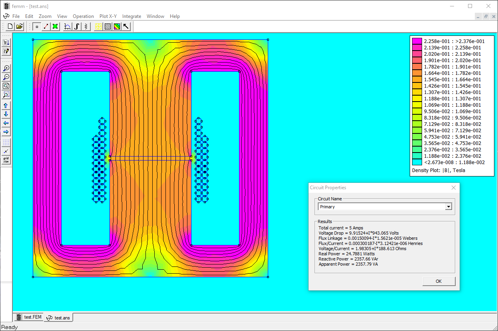
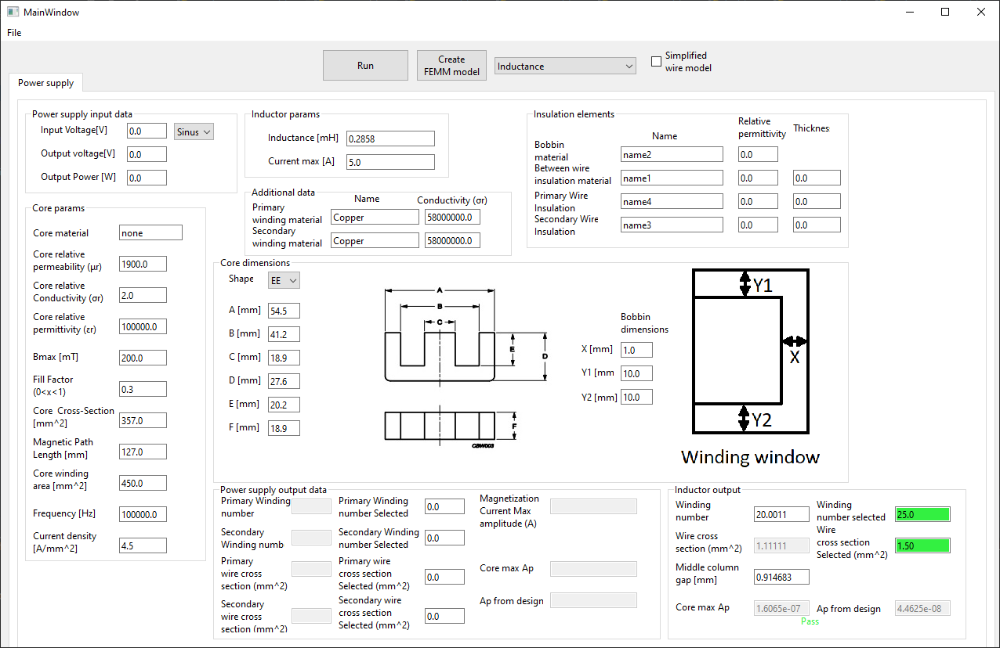

# Table of Contents
1. [Requirements](#Requirements)
2. [How to use](#Howtouse)
3. [Equations](#equations)
    1. [Transformer](#transformer)
    2. [Inductance](#inductance)

## Requirements 
Python 3.8.5 <

Calculator should work on linux and windowsm
however FEMM not work on linux. 

## How to use 

1. Clone repository and run cmd in TrafoCalc folder.
2. check python by type in cmd "python -- version", if it is 3.8.5
or better continue
    - if python command is not finded, install python
3. type "python main.py" to run window with app
4. In upper left corner pres "load" and choose example.json file
5. From upper right list choose between:
    - Inductance - There are used "Inductor params" and create draw with gap.
    It use space for bobbin and insulator layer for simplify model
    - Electrostatic field simulation - It use Transformer input data. Draw only one side window wires
    with bobbin and insulator layer
    - Magnetic field simulation - It use Transformer input data. Create draw without gap.
    It use space for bobbin and insulator layer for simplify model
6. Press Run for precalculate transformer or inductor
7. Press "Create FEMM model" for create .FEM file (Magnetic)
 or .FEE (electrostatic)
8. Load created file by FEMM

Example output of inductor model in FEMM

Main window with loaded example

## Equations 

### Transformer 
Assumptions:
1. Magnetic flux leakage are not taken into account
2. Permeability of core not change with flux density. B-H curve could be added in FEMM
3. Transformator work in symemetrical operation. That means starting point is not 0° of the waveform the input of the transformer, but 90°.

Based on the equations from the video:
https://www.youtube.com/watch?v=3nfqBzPMknY&t=463s

$$ N = {{\int_{0}^{\pi} U(t)dt} \over {2B_{max}A_e}} $$

$$ I_{max} = {{\int_{0}^{\pi} U(t)dt l_c} \over {2N^2 A_e μ_r μ_o}} $$

Where:

N - number of turns

U(t) - function of input voltage

Bmax - peak flux density

Ae - core cross section

Imax - peak current amplitude

lc - magnetic core path length

μo - permeability of free space, μr - relative permeability of the material

### Inductance 
Assumptions:
1. core reluctance estimated by full magnetic length
2. Gap effective cross-section caused by flux fringing estimated as A = (B + lg)(C + lg) where B and C are the side of the column where the gap is and lg gap lenth
3. Permeability of core not change with flux density. B-H curve could be added in FEMM
4. Equations are more accurate the smaller the gap is

Based on the equations from the video:

https://www.youtube.com/watch?v=GOGdEgyXkO8&t=227s

$$ N = {L I_{max} \over A B_{max}} $$

$$ l_g = {μ_oNI_{max} \over B_{max}} - {l_c \over μ_r} $$

Where:

N - number of turns

Imax - peak current amplitude

A - gap effective cross-section, 1st it's core cross-section, but after calculate lg, A is recalculated then angain lg. It's done 10 time for better estimation gap effective cross-section

Bmax - peak flux density

lg - gap length

μo - permeability of free space, μr - relative permeability of the material

lc - magnetic core path length
